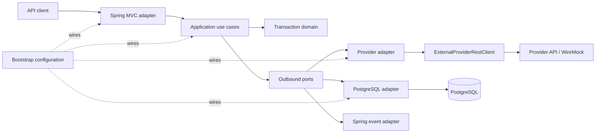
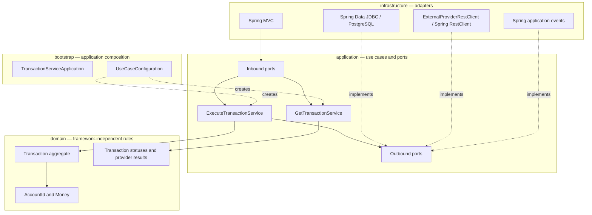
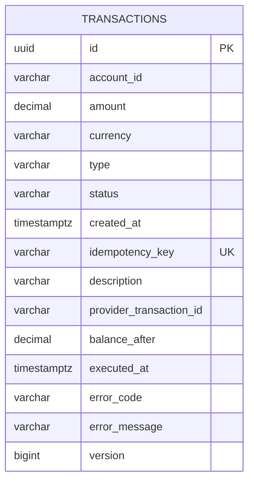

# Transaction Execution API

A Java 25 / Spring Boot service for executing credit and debit transactions through an external provider, persisting provider outcomes in PostgreSQL, and searching transaction history.

## Contents

- [Architecture](#architecture)
- [Requirements](#requirements)
- [Run with Docker Compose](#run-with-docker-compose)
- [Run locally with Gradle](#run-locally-with-gradle)
- [Provider mock](#provider-mock)
- [Build, test, and JavaDoc](#build-test-and-javadoc)
- [Persistence model](#persistence-model)
- [Project structure](#project-structure)

## Architecture

The Gradle modules express the hexagonal boundaries. Dependencies point inward: the domain is framework-independent, the application depends on the domain and outbound ports, infrastructure implements ports, and bootstrap composes the application.





The Gradle modules remain `domain`, `application`, `infrastructure:*`, and `bootstrap`; Java packages follow the original `com.spin.transactions.domain`, `.application`, and `.infrastructure` structure.

## Requirements

- Docker Engine/Desktop with Docker Compose v2
- JDK 25 only when running or building the app directly with Gradle (the repository's `.sdkmanrc` selects `25.0.2-open` when using SDKMAN)
- `curl` to export the generated OpenAPI YAML document

## Run with Docker Compose

From the repository root, build the Java 25 application image and start the API, PostgreSQL, and WireMock together:

```sh
docker compose up --build -d
```

The multi-stage `Dockerfile` builds the executable Spring Boot JAR with Java 25 and runs it in a Java 25 JRE image. Compose waits for PostgreSQL to become healthy before starting the API. The containers use Compose service DNS (`postgres` and `provider-mock`); ports `8080`, `5432`, and `8081` are published on the host. Flyway applies the database migrations on application startup.

If host port `8080` is already in use, choose another host port with `APP_PORT=18080 docker compose up --build -d`; the API will then be available at `http://localhost:18080`.

Check application startup and follow logs:

```sh
docker compose ps
docker compose logs -f transaction-service
```

Stop the containers while keeping PostgreSQL data:

```sh
docker compose down
```

To also delete the persisted local database volume:

```sh
docker compose down --volumes
```

### Run locally with Gradle

For development with the application process on the host, first install/select JDK 25 if using SDKMAN, then start only its dependencies:

```sh
sdk env install
sdk env
docker compose up -d postgres provider-mock
SPRING_DOCKER_COMPOSE_ENABLED=false ./gradlew :bootstrap:bootRun
```

The Compose override prevents Spring Boot's Docker Compose integration from starting the full stack (including a second API container). The host app connects to PostgreSQL and WireMock through `localhost`. Stop the app with `Ctrl+C` and stop dependencies with `docker compose down`.

### Quick smoke test

```sh
curl -i http://localhost:8080/transactions \
  -H 'Content-Type: application/json' \
  -H 'Idempotency-Key: transfer-001' \
  -d '{"accountId":"acc-123456","type":"CREDIT","amount":1500.00,"currency":"MXN","description":"Transfer received"}'

curl -i 'http://localhost:8080/transactions?accountId=acc-123456&page=0&limit=20'
```

The mock approves requests by default. Requests using `accountId: "acc-insufficient-funds"` receive a provider rejection.

## Provider mock

WireMock is configured in `provider-mock/mappings/transaction-responses.json`:

- `POST /provider/v1/execute` approves transactions by default.
- Transactions whose `accountId` is `acc-insufficient-funds` receive HTTP `422` with an `INSUFFICIENT_FUNDS` error.
- The provider request contains `accountId`, `type`, `amount`, and `currency`; the idempotency key is sent as a header.
- The provider's successful response supplies transaction ID, status, balance, and execution time.

Add or update WireMock mappings in that directory to simulate additional provider outcomes. The mappings are mounted read-only into the local provider container.

## Build, test, and JavaDoc

```sh
# Compile and package
./gradlew clean build

# Run unit and adapter tests without the Docker-backed integration test task
./gradlew test -x :bootstrap:test

# Run the architecture tests (no Docker required)
./gradlew :bootstrap:test --tests com.spin.transactions.HexagonalArchitectureTest

# Run the full suite, including PostgreSQL Testcontainers integration tests (Docker required)
./gradlew test

# Generate JavaDoc for each production module
./gradlew :domain:javadoc :application:javadoc \
  :infrastructure:spring-mvc-rest-adapter:javadoc \
  :infrastructure:postgres-jdbc-adapter:javadoc \
  :infrastructure:restclient-adapter:javadoc \
  :infrastructure:event-publisher-adapter:javadoc \
  :bootstrap:javadoc
```

JavaDoc output is under each module's `build/docs/javadoc/` directory.

## Persistence model

Flyway creates and evolves the `transactions` table. The idempotency key has a unique constraint so a request key cannot be stored twice. Account, creation time, status, and type indexes support transaction history queries.



## Project structure

```text
.
├── domain/                         Domain models, invariants, events, and exceptions
├── application/                    Use cases and inbound/outbound ports
├── infrastructure/
│   ├── spring-mvc-rest-adapter/    HTTP controllers, validation, DTOs, OpenAPI docs
│   ├── postgres-jdbc-adapter/      PostgreSQL persistence, JDBC, and Flyway migrations
│   ├── restclient-adapter/         Provider client, HTTP wrapper, timeout, circuit breaker
│   └── event-publisher-adapter/    Spring domain-event publisher
├── bootstrap/                      Runnable Spring Boot app and use-case wiring
├── provider-mock/                  WireMock mappings for local provider behavior
├── build-logic/                    Shared Gradle convention plugins
├── compose.yaml                    Local PostgreSQL and provider mock
└── README.md
```

### Responsibility boundaries

| Module | Responsibility |
|---|---|
| `domain` | Transaction invariants, lifecycle, value objects, events, and domain exceptions; no Spring dependency |
| `application` | Execute/search use cases and ports; orchestration without database or HTTP implementation details |
| `infrastructure:spring-mvc-rest-adapter` | HTTP request validation, response mapping, exception mapping, and OpenAPI/Swagger documentation |
| `infrastructure:postgres-jdbc-adapter` | Transaction storage/search, Spring Data JDBC, unit-of-work implementation, and Flyway schema |
| `infrastructure:restclient-adapter` | External provider HTTP wrapper, response mapping, timeouts, and circuit breaker |
| `infrastructure:event-publisher-adapter` | Publishes domain events using Spring application events |
| `bootstrap` | Application entry point, environment configuration, and use-case dependency wiring |
